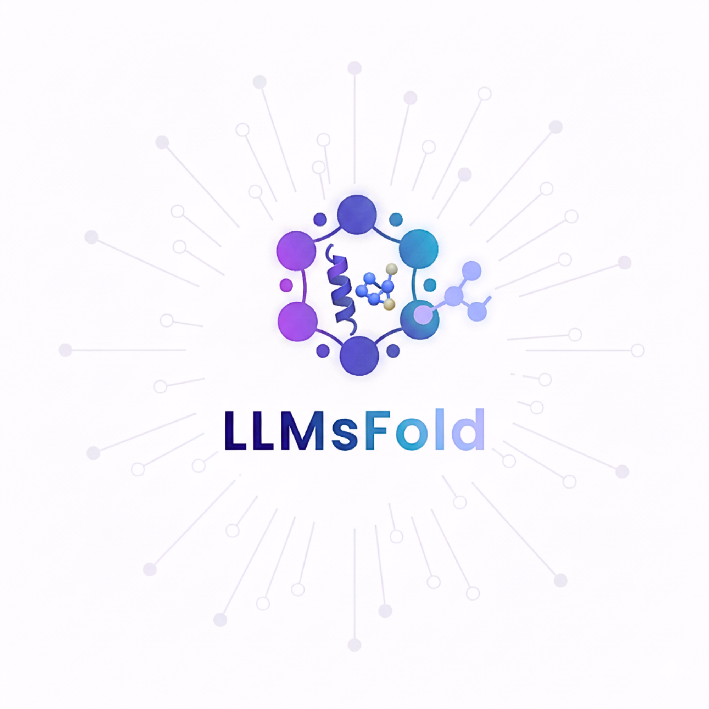
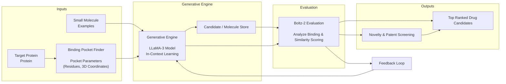
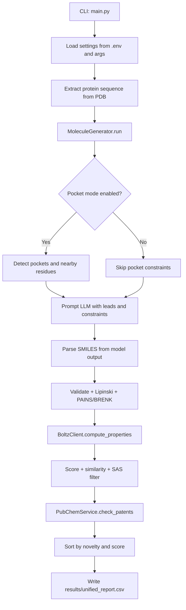

# LLMsFold: AI Molecular Generation Framework
<p align="center">
  
</p>

LLMsFold is an automated molecule generation pipeline for early drug discovery. It combines LLM-driven proposal generation with NVIDIA Boltz scoring, chemistry filters, and PubChem novelty checks.

## Authors

- W. W. Waththe Liyanage `†`  
  [](https://www.maps.unipd.it/en/department)

- Fabio Bove `†`  
  [](https://www.maps.unipd.it/en/department)
  [](https://www.unimore.it/en/university/departments-schools-and-faculties/department-physical-computer-and-mathematical-sciences)
  [](https://tacclab.org/)
  [](https://www.neoralab.com/)

- Dario Righelli  
  [](https://www.unipd.it/en/en/university/scientific-and-academic-structures/departments/department-biology)
  [](https://www.cst.cam.ac.uk/)

- Salvatore Romano  
  [](https://www.dieei.unict.it/en/)
  [](https://www.cst.cam.ac.uk/)
  [](https://www.unicampus.it/en/)

- Rosa Visone  
  [](https://www.cast.unich.it/en/)

- Marilena V. Iorio  
  [](https://www.istitutotumori.mi.it/en)

- Pietro Lio `§`  
  [](https://www.cst.cam.ac.uk/)

- Cristian Taccioli `§*`  
  [](https://www.maps.unipd.it/en/department)
  [](https://www.cst.cam.ac.uk/)
  [](https://tacclab.org/)

## Affiliations

- [](https://www.maps.unipd.it/en/department) Department of Animal Medicine, Production and Health (MAPS), University of Padova, Legnaro, Italy
- [](https://www.cst.cam.ac.uk/) Department of Computer Science and Technology, William Gates Building, University of Cambridge, Cambridge CB3 0FD, UK
- [](https://www.cast.unich.it/en/) Center for Advanced Studies and Technology (CAST), and Department of Medical, Oral and Biotechnological Sciences, G. d'Annunzio University, Chieti, Italy
- [](https://www.istitutotumori.mi.it/en) Department of Experimental Oncology, Fondazione IRCCS Istituto Nazionale Tumori, Milan, Italy
- [](https://www.unimore.it/en/university/departments-schools-and-faculties/department-physical-computer-and-mathematical-sciences) Department of Physical, Computer and Mathematical Sciences (FIM), University of Modena and Reggio Emilia, Modena, Italy
- [](https://www.unipd.it/en/en/university/scientific-and-academic-structures/departments/department-biology) Department of Biology, University of Padova, Padova, Italy
- [](https://www.dieei.unict.it/en/) Department of Electrical, Electronic and Computer Engineering, University of Catania, Catania, Italy
- [](https://www.unicampus.it/en/) University Campus Bio-Medico of Rome, Rome, Italy

## Author Notes

- `†` Co-first authors
- `§` Co-senior authors
- `*` Corresponding author

## Preprint
- `LLMsFold: Integrating Large Language Models and Biophysical Simulations for De Novo Drug Design`
- bioRxiv: https://www.biorxiv.org/content/10.64898/2026.03.02.709055v1

## The LLMsFold Framework


## Architecture

## Key Features
- Async end-to-end orchestration with reusable HTTP clients.
- Pocket-aware mode with residue-constrained Boltz requests.
- Iterative LLM loop with context leads across rounds.
- RDKit filters (validity, Lipinski, PAINS/BRENK, SAS cutoff).
- Built-in novelty and patent signal checks via PubChem APIs.

## Repository Layout
```text
LLMsFold/
|- main.py
|- run.sh
|- .env.example
|- src/
|  |- generator.py
|  |- nvidia_client.py
|  |- chemistry.py
|  |- pocket.py
|  |- prompt.py
|  |- schemas.py
|  |- clients/factory.py
|  |- services/pubchem.py
|  `- core/{config,constants,logging}.py
|- tests/
|- data/
|- images/
`- doc/
```

## Requirements
- Python `>=3.12`
- API keys:
  - `GROQ_API_KEY`
  - `NVIDIA_API_KEY`

## Setup
### 1. Install dependencies with uv (recommended)
```bash
uv sync --group dev
```

### 2. Configure environment
```bash
cp .env.example .env
```
Fill in API keys and adjust paths as needed.

## Configuration
| Variable | Required | Default | Description |
| --- | --- | --- | --- |
| `GROQ_API_KEY` | Yes | - | Groq API key for LLM generation |
| `NVIDIA_API_KEY` | Yes | - | NVIDIA API key for Boltz predictions |
| `PDB_FILE` | No | `data/acvr1_R206H_clean.pdb` | Target protein PDB path |
| `FEW_SHOT_CSV` | No | `data/few_shot_smiles_patent.csv` | Seed molecules CSV (`;` separated, `Smiles` column) |
| `OUTPUT_DIR` | No | `results` | Output directory |
| `MAX_ITERATIONS` | No | `3` | RL-style loop iterations |
| `MAX_SAMPLES` | No | `5` | LLM proposals per iteration |
| `LLM_MODEL` | No | `llama-3.3-70b-versatile` | Groq model name |
| `LLM_TEMPERATURE` | No | `0.8` | LLM temperature (`0.0` to `2.0`) |
| `BEST_STRUCTURE_AFFINITY_THRESHOLD` | No | - | Save Boltz docked structures for candidates with `Affinity_Prob` above this threshold (`0.0` to `1.0`) |
| `NEORALAB_VIEWER_URL` | No | `https://neoralab.app/viewer` | Viewer endpoint used for automatic best-result preview |
| `NEORALAB_VIEWER_CLIENT_ID` | No | - | Client ID used to authenticate the automatic viewer preview |
| `NEORALAB_VIEWER_CLIENT_SECRET` | No | - | Client secret used to authenticate the automatic viewer preview |
| `BOLTZ_RETRY_ATTEMPTS` | No | `4` | Retry budget for Boltz HTTP `429` responses |
| `BOLTZ_RETRY_MIN_WAIT_SECONDS` | No | `2.0` | Initial tenacity backoff for Boltz HTTP `429` responses |
| `BOLTZ_RETRY_MAX_WAIT_SECONDS` | No | `30.0` | Maximum tenacity backoff for Boltz HTTP `429` responses |
| `LOG_LEVEL` | No | `INFO` | Logging level |

## Usage
### Run with uv
```bash
uv run --env-file .env main.py --iters 3 --samples 5
```

### Run with helper script
```bash
chmod +x run.sh
./run.sh
```

### Non-interactive mode
Pocket selection is interactive when enabled. For CI or batch runs, disable it:
```bash
uv run --env-file .env main.py --no-pocket
```

## Output
Primary artifact: `results/unified_report.csv`

Optional artifacts (when `BEST_STRUCTURE_AFFINITY_THRESHOLD` is set):
- `results/best/<candidate-id>/data/metadata.json` containing the candidate `smiles`, Boltz `evaluation`, `pdb`, and `structure` payload for high-affinity hits.
- `results/best/<candidate-id>/preview/neoralab_viewer_autoload.html` when `NEORALAB_VIEWER_CLIENT_ID` and `NEORALAB_VIEWER_CLIENT_SECRET` are configured; opening this file auto-submits the saved `metadata.json` and `structure.cif` to the NeoraLab viewer.

Important columns include:
- Activity/confidence: `Affinity_Prob`, `pIC50`, `IC50_uM`, `pTM`, `ipTM`, `pLDDT`
- Drug-like properties: `MolWt`, `LogP`, `QED`, `SAS`, `TPSA`, `H_Acceptors`, `H_Donors`
- Ranking/novelty: `MaxSim`, `adj_affinity`, `score`, `PubChem_CID`, `PubChem_Known`

## Documentation
- Docs index: `doc/README.md`
- System architecture: `doc/architecture.md`
- Per-component docs: `doc/components/`

## Development
```bash
uv run pytest
uv run ruff check .
uv run mypy
```
