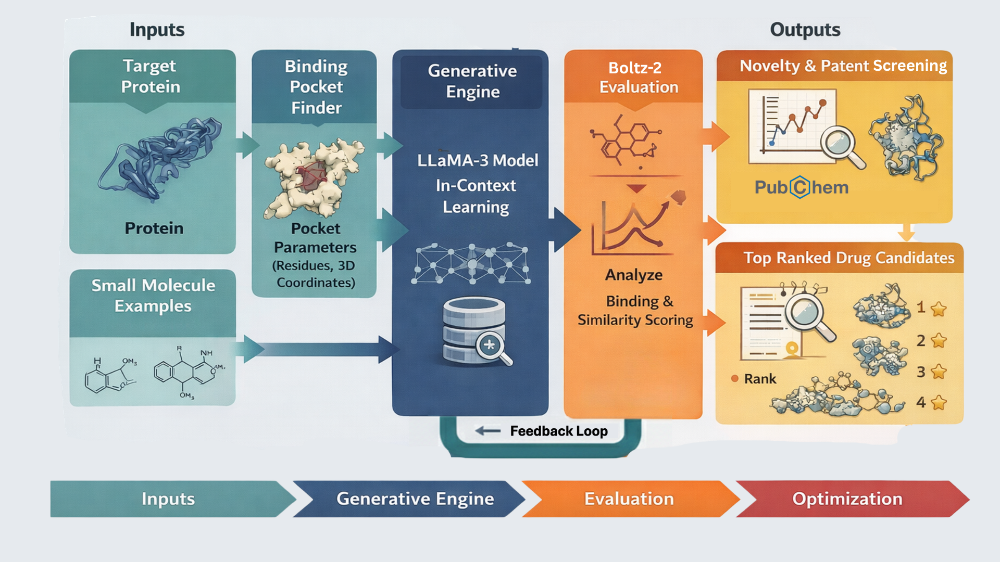
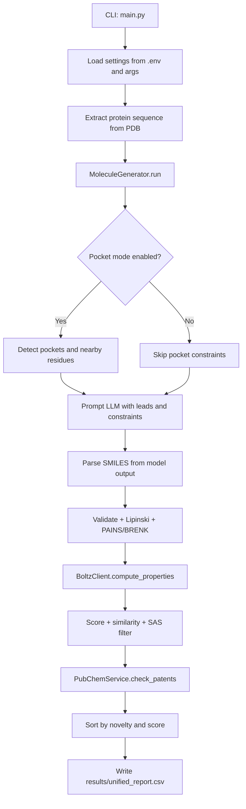

# LLMsFold: AI Molecular Generation Framework
<p align="center">
  
</p>

LLMsFold is an automated molecule generation pipeline for early drug discovery. It combines LLM-driven proposal generation with NVIDIA Boltz scoring, chemistry filters, and PubChem novelty checks.

## The LLMsFold Framework
<p align="center">
  
</p>


## Architecture

## Key Features
- Async end-to-end orchestration with reusable HTTP clients.
- Pocket-aware mode with residue-constrained Boltz requests.
- Iterative LLM loop with context leads across rounds.
- RDKit filters (validity, Lipinski, PAINS/BRENK, SAS cutoff).
- Built-in novelty and patent signal checks via PubChem APIs.

## Repository Layout
```text
LLMsFold/
|- main.py
|- run.sh
|- .env.example
|- src/
|  |- generator.py
|  |- nvidia_client.py
|  |- chemistry.py
|  |- pocket.py
|  |- prompt.py
|  |- schemas.py
|  |- clients/factory.py
|  |- services/pubchem.py
|  `- core/{config,constants,logging}.py
|- tests/
|- data/
|- images/
`- doc/
```

## Requirements
- Python `>=3.12`
- API keys:
  - `GROQ_API_KEY`
  - `NVIDIA_API_KEY`
- RDKit SA score assets (already included in this repo):
  - `sascorer.py`
  - `fpscores.pkl.gz`

## Setup
### 1. Install dependencies with uv (recommended)
```bash
uv sync --group dev
```

### 2. Configure environment
```bash
cp .env.example .env
```
Fill in API keys and adjust paths as needed.

## Configuration
| Variable | Required | Default | Description |
| --- | --- | --- | --- |
| `GROQ_API_KEY` | Yes | - | Groq API key for LLM generation |
| `NVIDIA_API_KEY` | Yes | - | NVIDIA API key for Boltz predictions |
| `PDB_FILE` | No | `data/target.pdb` | Target protein PDB path |
| `FEW_SHOT_CSV` | No | `data/few_shot_smiles1.csv` | Seed molecules CSV (`;` separated, `Smiles` column) |
| `OUTPUT_DIR` | No | `results` | Output directory |
| `MAX_ITERATIONS` | No | `3` | RL-style loop iterations |
| `MAX_SAMPLES` | No | `5` | LLM proposals per iteration |
| `LLM_MODEL` | No | `llama-3.3-70b-versatile` | Groq model name |
| `LLM_TEMPERATURE` | No | `0.8` | LLM temperature (`0.0` to `2.0`) |
| `LOG_LEVEL` | No | `INFO` | Logging level |

## Usage
### Run with uv
```bash
uv run --env-file .env main.py --iters 3 --samples 5
```

### Run with helper script
```bash
chmod +x run.sh
./run.sh
```

### Non-interactive mode
Pocket selection is interactive when enabled. For CI or batch runs, disable it:
```bash
uv run --env-file .env main.py --no-pocket
```

## Output
Primary artifact: `results/unified_report.csv`

Important columns include:
- Activity/confidence: `Affinity_Prob`, `pIC50`, `IC50_uM`, `pTM`, `ipTM`, `pLDDT`
- Drug-like properties: `MolWt`, `LogP`, `QED`, `SAS`, `TPSA`, `H_Acceptors`, `H_Donors`
- Ranking/novelty: `MaxSim`, `adj_affinity`, `score`, `PubChem_CID`, `Is_Novel`

## Documentation
- Docs index: `doc/README.md`
- System architecture: `doc/architecture.md`
- Per-component docs: `doc/components/`

## Development
```bash
uv run pytest
uv run ruff check .
uv run mypy
```
