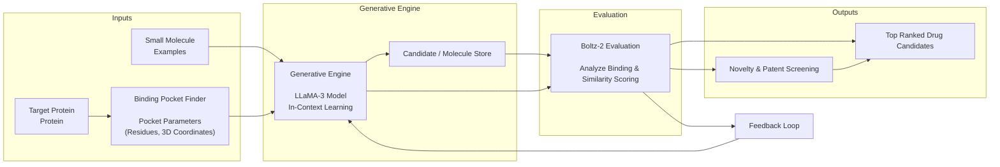
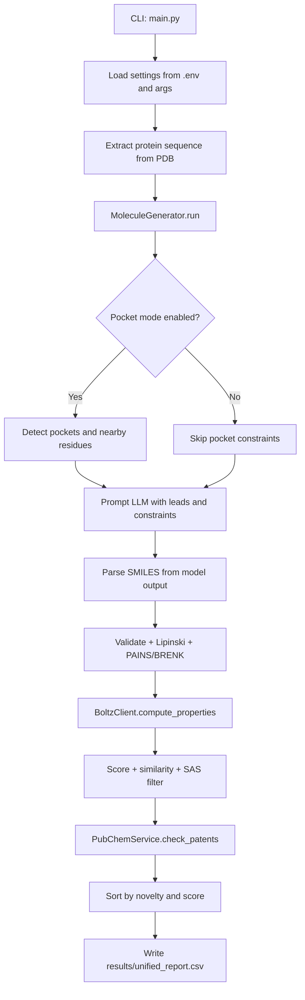

# LLMsFold: AI Molecular Generation Framework
<p align="center">
  
</p>

LLMsFold is an automated molecule generation pipeline for early drug discovery. It combines LLM-driven proposal generation with NVIDIA Boltz scoring, chemistry filters, and PubChem novelty checks.

Core LLMsFold runs entirely on its own and produces ranked candidate outputs locally. Optionally, users can connect the NeoraLab platform by NeoraLab company to automatically publish and view the best saved candidate in the NeoraLab viewer.

## Authors

- W. W. Waththe Liyanage `†`  
  [](https://www.maps.unipd.it/en/department)

- Fabio Bove `†`  
  [](https://www.maps.unipd.it/en/department)
  [](https://www.unimore.it/en/university/departments-schools-and-faculties/department-physical-computer-and-mathematical-sciences)
  [](https://tacclab.org/)
  [](https://www.neoralab.com/)

- Dario Righelli  
  [](https://www.unipd.it/en/en/university/scientific-and-academic-structures/departments/department-biology)
  [](https://www.cst.cam.ac.uk/)

- Salvatore Romano  
  [](https://www.dieei.unict.it/en/)
  [](https://www.cst.cam.ac.uk/)
  [](https://www.unicampus.it/en/)

- Rosa Visone  
  [](https://www.cast.unich.it/en/)

- Marilena V. Iorio  
  [](https://www.istitutotumori.mi.it/en)

- Pietro Lio `§`  
  [](https://www.cst.cam.ac.uk/)

- Cristian Taccioli `§*`  
  [](https://www.maps.unipd.it/en/department)
  [](https://www.cst.cam.ac.uk/)
  [](https://tacclab.org/)

## Affiliations

- [](https://www.maps.unipd.it/en/department) Department of Animal Medicine, Production and Health (MAPS), University of Padova, Legnaro, Italy
- [](https://www.cst.cam.ac.uk/) Department of Computer Science and Technology, William Gates Building, University of Cambridge, Cambridge CB3 0FD, UK
- [](https://www.cast.unich.it/en/) Center for Advanced Studies and Technology (CAST), and Department of Medical, Oral and Biotechnological Sciences, G. d'Annunzio University, Chieti, Italy
- [](https://www.istitutotumori.mi.it/en) Department of Experimental Oncology, Fondazione IRCCS Istituto Nazionale Tumori, Milan, Italy
- [](https://www.unimore.it/en/university/departments-schools-and-faculties/department-physical-computer-and-mathematical-sciences) Department of Physical, Computer and Mathematical Sciences (FIM), University of Modena and Reggio Emilia, Modena, Italy
- [](https://www.unipd.it/en/en/university/scientific-and-academic-structures/departments/department-biology) Department of Biology, University of Padova, Padova, Italy
- [](https://www.dieei.unict.it/en/) Department of Electrical, Electronic and Computer Engineering, University of Catania, Catania, Italy
- [](https://www.unicampus.it/en/) University Campus Bio-Medico of Rome, Rome, Italy

## Author Notes

- `†` Co-first authors
- `§` Co-senior authors
- `*` Corresponding author

## Preprint
- `LLMsFold: Integrating Large Language Models and Biophysical Simulations for De Novo Drug Design`
- bioRxiv: https://www.biorxiv.org/content/10.64898/2026.03.02.709055v1

## The LLMsFold Framework


## Architecture

## Key Features
- Async end-to-end orchestration with reusable HTTP clients.
- Pocket-aware mode with residue-constrained Boltz requests.
- Iterative LLM loop with context leads across rounds.
- RDKit filters (validity, Lipinski, PAINS/BRENK, SAS cutoff).
- Built-in novelty and patent signal checks via PubChem APIs.

## Repository Layout
```text
LLMsFold/
|- main.py
|- run.sh
|- .env.example
|- src/
|  |- generator.py
|  |- nvidia_client.py
|  |- chemistry.py
|  |- pocket.py
|  |- prompt.py
|  |- schemas.py
|  |- clients/factory.py
|  |- services/pubchem.py
|  `- core/{config,constants,logging}.py
|- tests/
|- data/
|- images/
`- doc/
```

## Requirements
- Python `>=3.12`
- API keys:
  - `GROQ_API_KEY`
  - `NVIDIA_API_KEY`

## Setup
### 1. Install dependencies with uv (recommended)
```bash
uv sync --group dev
```

### 2. Configure environment
```bash
cp .env.example .env
```
Fill in API keys and adjust paths as needed.

## Core Configuration
| Variable | Required | Default | Description |
| --- | --- | --- | --- |
| `GROQ_API_KEY` | Yes | - | Groq API key for LLM generation |
| `NVIDIA_API_KEY` | Yes | - | NVIDIA API key for Boltz predictions |
| `PDB_FILE` | No | `data/acvr1_R206H_clean.pdb` | Target protein PDB path |
| `FEW_SHOT_CSV` | No | `data/few_shot_smiles_patent.csv` | Seed molecules CSV (`;` separated, `Smiles` column) |
| `OUTPUT_DIR` | No | `results` | Output directory |
| `MAX_ITERATIONS` | No | `3` | RL-style loop iterations |
| `MAX_SAMPLES` | No | `5` | LLM proposals per iteration |
| `LLM_MODEL` | No | `llama-3.3-70b-versatile` | Groq model name |
| `LLM_TEMPERATURE` | No | `0.8` | LLM temperature (`0.0` to `2.0`) |
| `BEST_STRUCTURE_AFFINITY_THRESHOLD` | No | - | Save Boltz docked structures for candidates with `Affinity_Prob` above this threshold (`0.0` to `1.0`) |
| `BOLTZ_RETRY_ATTEMPTS` | No | `4` | Retry budget for Boltz HTTP `429` responses |
| `BOLTZ_RETRY_MIN_WAIT_SECONDS` | No | `2.0` | Initial tenacity backoff for Boltz HTTP `429` responses |
| `BOLTZ_RETRY_MAX_WAIT_SECONDS` | No | `30.0` | Maximum tenacity backoff for Boltz HTTP `429` responses |
| `LOG_LEVEL` | No | `INFO` | Logging level |

## Optional NeoraLab Viewer Integration
This integration is separate from the core LLMsFold pipeline.

You only need this if you want LLMsFold to automatically publish the best saved result to the NeoraLab platform by NeoraLab company and open it in the NeoraLab viewer. If you do not configure it, LLMsFold still runs normally and keeps all outputs local.

### Optional NeoraLab environment variables
Add these variables to `.env` only if you want to enable the NeoraLab upload and viewer flow:

| Variable | Required for NeoraLab flow | Default | Description |
| --- | --- | --- | --- |
| `BEST_STRUCTURE_AFFINITY_THRESHOLD` | Yes | - | Saves Boltz docked structures for candidates with `Affinity_Prob` above this threshold. This must be set or there is no saved structure to upload. |
| `NEORALAB_API_BASE_URL` | Yes | `https://neoralab.app` | NeoraLab backend base URL used for OAuth and repository upload. |
| `NEORALAB_VIEWER_URL` | Yes | `https://neoralab.app/app/viewer` | NeoraLab viewer URL used for automatic best-result preview. |
| `NEORALAB_VIEWER_CLIENT_ID` | Yes | - | Client ID used to authenticate the optional viewer upload flow. |
| `NEORALAB_VIEWER_CLIENT_SECRET` | Yes | - | Client secret used to authenticate the optional viewer upload flow. |

### 1. Create or request a NeoraLab account
Open `https://www.neoralab.com/signin` from the NeoraLab `Get started` flow and sign in with your workspace account.

If your workspace does not expose self-service registration, request access from your NeoraLab administrator or contact `contact@neoralab.com`.

### 2. Create a client-credentials app in NeoraLab
Inside NeoraLab, create an OAuth client that is allowed to use the `client_credentials` grant.

You will need the generated:
- `client_id`
- `client_secret`

Store the secret immediately when it is shown. LLMsFold uses these credentials to obtain an access token from `/oauth/token` and upload viewer payloads to the NeoraLab repository API.

### 3. Configure the repository
Add the NeoraLab settings to `.env`:

```bash
BEST_STRUCTURE_AFFINITY_THRESHOLD=0.03
NEORALAB_API_BASE_URL=https://neoralab.app
NEORALAB_VIEWER_URL=https://neoralab.app/app/viewer
NEORALAB_VIEWER_CLIENT_ID=your-client-id
NEORALAB_VIEWER_CLIENT_SECRET=your-client-secret
```

Notes:
- `BEST_STRUCTURE_AFFINITY_THRESHOLD` must be set, otherwise no Boltz structures are persisted and there is nothing to upload to NeoraLab.
- `NEORALAB_API_BASE_URL` should point to the backend that serves `/oauth/token` and `/api/v1/repository/`.
- `NEORALAB_VIEWER_URL` is the UI route that will be opened after a successful upload.
- Keep `NEORALAB_VIEWER_CLIENT_SECRET` private and never commit it to version control.

### 4. What happens during a run
When these settings are configured, LLMsFold does the following at the end of the pipeline:

1. It writes `results/unified_report.csv` as usual.
2. It saves Boltz docked structures for candidates whose `Affinity_Prob` is greater than `BEST_STRUCTURE_AFFINITY_THRESHOLD` under `results/best/<candidate-id>/data/`.
3. It selects the top-ranked saved candidate.
4. It authenticates against NeoraLab with the configured `client_id` and `client_secret`.
5. It uploads `metadata.json` and `structure.cif` as a NeoraLab repository item of type `viewer`.
6. It builds a deep link to the NeoraLab viewer and tries to open it in your browser automatically.

If the NeoraLab credentials are not configured, the pipeline still runs normally; only the NeoraLab upload and auto-open step is skipped.

## Usage
### Run with uv
```bash
uv run --env-file .env main.py --iters 3 --samples 5
```

### Run with helper script
```bash
chmod +x run.sh
./run.sh
```

### Non-interactive mode
Pocket selection is interactive when enabled. For CI or batch runs, disable it:
```bash
uv run --env-file .env main.py --no-pocket
```

## Output
Primary artifact: `results/unified_report.csv`

Optional artifacts (when `BEST_STRUCTURE_AFFINITY_THRESHOLD` is set):
- `results/best/<candidate-id>/data/metadata.json` containing the candidate `smiles`, Boltz `evaluation`, `pdb`, and `structure` payload for high-affinity hits.

Optional NeoraLab behavior (when `NEORALAB_VIEWER_CLIENT_ID` and `NEORALAB_VIEWER_CLIENT_SECRET` are configured):
- LLMsFold uploads the top-ranked saved result to the NeoraLab repository as a viewer item.
- LLMsFold then opens the NeoraLab viewer URL for that uploaded item in your default browser.

Important columns include:
- Activity/confidence: `Affinity_Prob`, `pIC50`, `IC50_uM`, `pTM`, `ipTM`, `pLDDT`
- Drug-like properties: `MolWt`, `LogP`, `QED`, `SAS`, `TPSA`, `H_Acceptors`, `H_Donors`
- Ranking/novelty: `MaxSim`, `adj_affinity`, `score`, `PubChem_CID`, `PubChem_Known`

## Optional External Viewer: NeoraLab Platform

This section describes an optional integration. It is not required to run LLMsFold.

If desired, users can use the NeoraLab platform by NeoraLab company to upload and inspect the best saved candidate in a hosted molecular viewer. This is a separate post-processing step on top of the standard LLMsFold pipeline.

Without NeoraLab configured:
- LLMsFold still completes normally.
- All core generation, Boltz scoring, filtering, ranking, and CSV export remain available locally.
- No external upload or viewer redirect is attempted.

With NeoraLab configured:
- LLMsFold uploads the top-ranked saved structure to the NeoraLab repository.
- It then opens that result in the NeoraLab viewer for inspection.

See `Optional NeoraLab Viewer Integration` above for the required environment variables and setup steps.

## Documentation
- Docs index: `doc/README.md`
- System architecture: `doc/architecture.md`
- Per-component docs: `doc/components/`

## Development
```bash
uv run pytest
uv run ruff check .
uv run mypy
```
