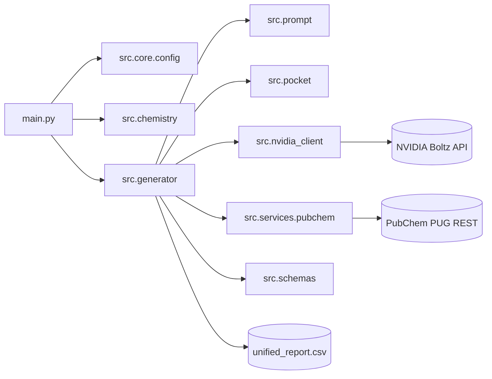
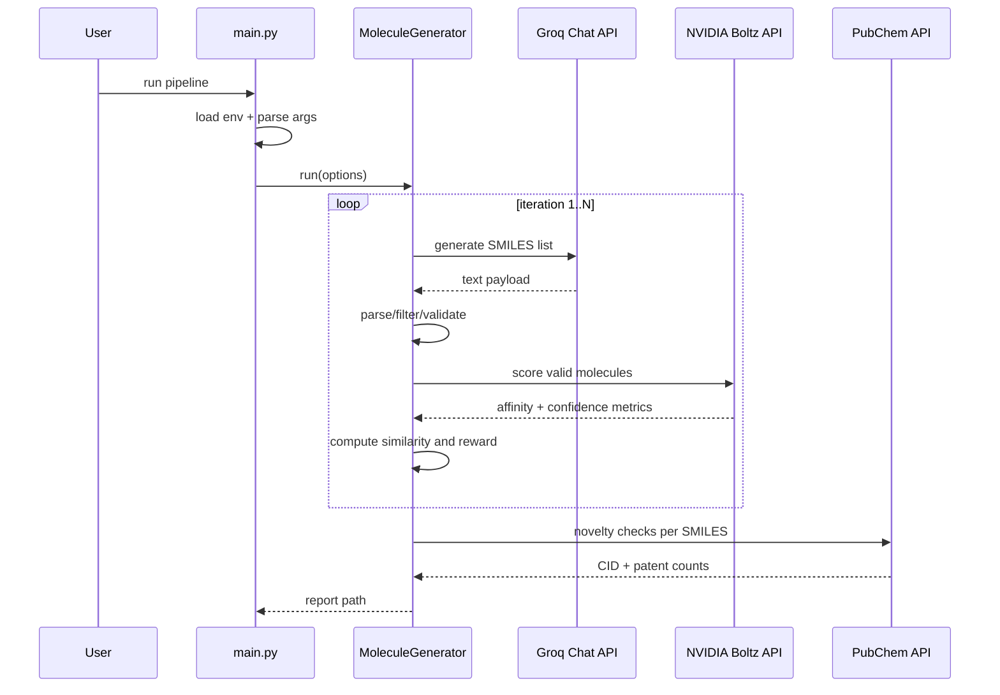

# System Architecture

## Runtime Flow

## Request-Level Sequence

## Data Contracts
- Runtime options are validated by `PipelineOptions`.
- Boltz responses are normalized by `BoltzPrediction` and `BoltzLigandAffinity`.
- Final per-molecule rows are represented by `MoleculeRecord` plus patent fields from `PatentCheckResult`.

## Failure Boundaries
- Missing env keys: startup validation error in `main.py`.
- External API errors: handled in service/client layers and downgraded to empty/default results where possible.
- No surviving molecules: generator returns `None` and logs warning instead of writing a report.
