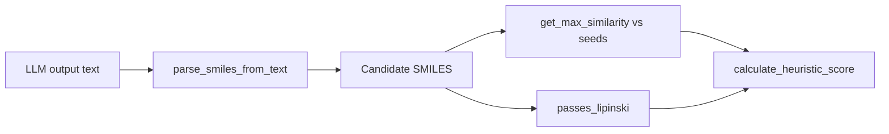

# Component: Chemistry Helpers (`src/chemistry.py`)

## Purpose
Provides chemistry-focused utility functions used by generator and CLI.

## Functions
- `extract_sequence_from_pdb(pdb_path)`
- `calculate_heuristic_score(row)`
- `passes_lipinski(mol)`
- `get_max_similarity(smiles, target_fps)`
- `parse_smiles_from_text(raw_text)`

## Utility Graph

## Key Rules
- Lipinski pass requires:
  - `MolWt <= 500`
  - `MolLogP <= 5`
  - `NumHDonors <= 5`
  - `NumHAcceptors <= 10`
- Similarity uses Morgan fingerprints (radius 2) + Tanimoto.
- Reward penalizes very high similarity (`MaxSim > 0.9`).

## Parsing Behavior
- Expects a Python-list-like response with quoted entries.
- Only entries matching a SMILES-like regex (length >= 5) are returned.
- Invalid or malformed payloads return an empty list.
