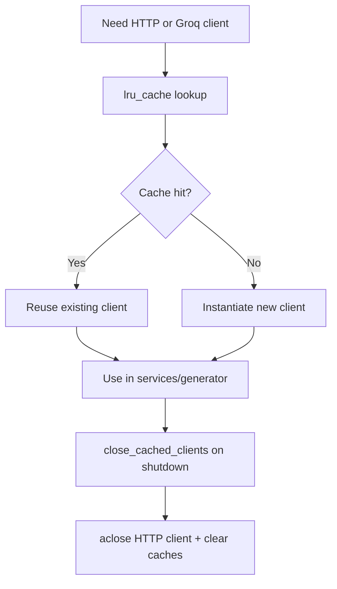

# Component: Client Factory (`src/clients/factory.py`)

## Purpose
Provides cached shared network clients and deterministic async cleanup.

## Functions
- `get_cached_http_client()`
- `get_cached_groq_client(api_key)`
- `close_cached_clients()`

## Lifecycle

## Cache Strategy
- HTTP client: single instance (`maxsize=1`).
- Groq clients: keyed cache (`maxsize=2`) by API key.

## Shutdown Guarantees
- If HTTP client exists and is open, it is explicitly closed.
- Both caches are cleared after shutdown.
