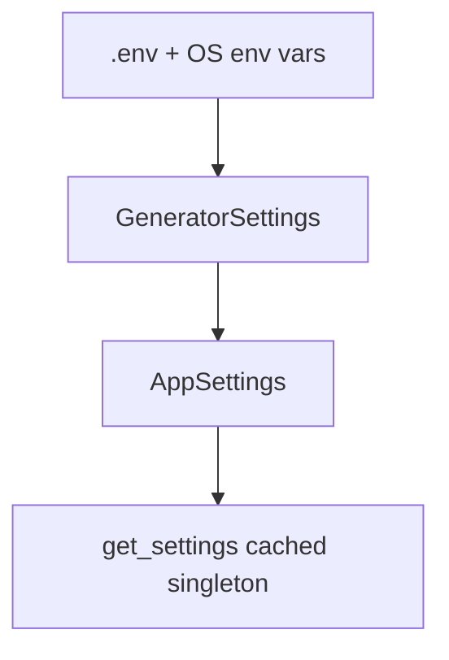

# Component: Config and Schemas (`src/core/config.py`, `src/schemas.py`)

## Purpose
Centralizes runtime configuration and payload/data validation.

## Configuration Model

## Settings Types
- `GeneratorSettings`
  - `LLM_MODEL`
  - `LLM_TEMPERATURE` (0.0 to 2.0)
  - Optional service controls for Boltz and PubChem polling/timeouts
- `AppSettings` (extends `GeneratorSettings`)
  - Required: `GROQ_API_KEY`, `NVIDIA_API_KEY`
  - Optional with defaults: `PDB_FILE`, `FEW_SHOT_CSV`, `OUTPUT_DIR`, `MAX_ITERATIONS`, `MAX_SAMPLES`, `LOG_LEVEL`

## Schema Types
- `PipelineOptions`: validated runtime inputs for generator, with `pathlib.Path` fields.
- `GeneratedMolecule` / `ModelOutput`: validated LLM molecule proposals and normalized model output.
- `PocketContact`: validated residue contact shared by generator and Boltz client.
- `BoltzRequest`, `BoltzLigandAffinity`, `BoltzPrediction`: validated NVIDIA request/response payloads.
- `MoleculeRecord`: final per-candidate score/property row.
- `UnifiedReportRow`: fully validated CSV row written to `results/unified_report.csv`.
- `PatentCheckResult`: PubChem identity/substructure summary with validated report formatter.

## Validation Highlights
- `PipelineOptions.max_iterations >= 1`
- `PipelineOptions.max_samples >= 1`
- SMILES strings are validated with RDKit before entering Boltz/report schemas.
- LLM outputs are normalized into unique validated molecules before downstream filtering.
- Final report rows enforce consistency between `PubChem_CID` and `PubChem_Known`.
- Unknown keys in Boltz payload are ignored instead of failing parsing.
