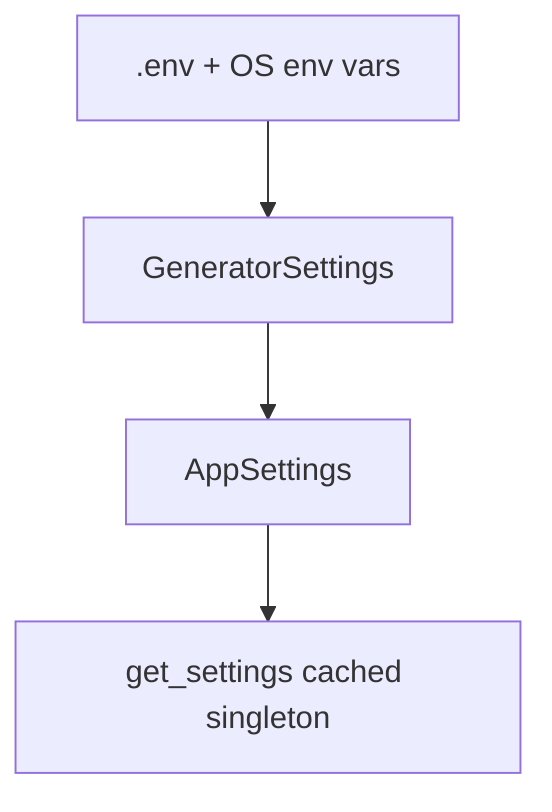

# Component: Config and Schemas (`src/core/config.py`, `src/schemas.py`)

## Purpose
Centralizes runtime configuration and payload/data validation.

## Configuration Model

## Settings Types
- `GeneratorSettings`
  - `LLM_MODEL`
  - `LLM_TEMPERATURE` (0.0 to 2.0)
- `AppSettings` (extends `GeneratorSettings`)
  - Required: `GROQ_API_KEY`, `NVIDIA_API_KEY`
  - Optional with defaults: `PDB_FILE`, `FEW_SHOT_CSV`, `OUTPUT_DIR`, `MAX_ITERATIONS`, `MAX_SAMPLES`, `LOG_LEVEL`

## Schema Types
- `PipelineOptions`: validated runtime inputs for generator.
- `BoltzLigandAffinity`, `BoltzPrediction`: normalized NVIDIA response with `extra="ignore"`.
- `MoleculeRecord`: final per-candidate score/property row.
- `PatentCheckResult`: PubChem identity/substructure summary with report formatter.

## Validation Highlights
- `PipelineOptions.max_iterations >= 1`
- `PipelineOptions.max_samples >= 1`
- Unknown keys in Boltz payload are ignored instead of failing parsing.
