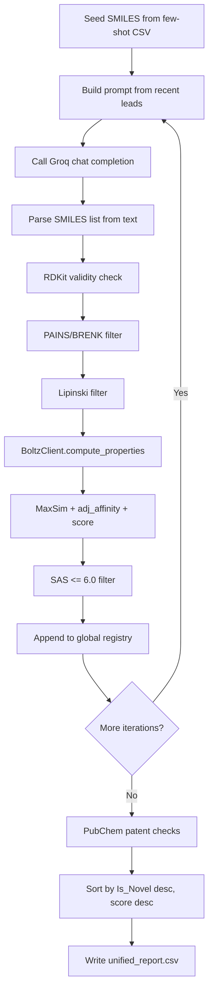

# Component: Generator (`src/generator.py`)

## Purpose
Implements the iterative molecule generation and ranking loop.

## Core Class
- `MoleculeGenerator`
  - Dependencies:
    - Groq client via `get_cached_groq_client`
    - `BoltzClient` for model-based scoring
    - `PubChemService` for novelty/patent checks
    - RDKit PAINS/BRENK filter catalog (cached)

## Iteration Pipeline

## Scoring Logic
- `adj_affinity = Affinity_Prob` when `Affinity_Prob > 0.6`, else `0`.
- `score = adj_affinity` with over-similarity penalty:
  - If `MaxSim > 0.9`, score is reduced by `0.5 * adj_affinity`.
- Final molecules are filtered with `SAS <= 6.0`.

## Pocket-Aware Mode
- If enabled, obtains pocket residues via `get_binding_pockets_and_residues`.
- Residue labels (for example `ALA10_A`) are converted to integer indices before Boltz calls.
- If disabled, prompt switches to analog generation without pocket constraints.

## Inputs
- `PipelineOptions` with PDB path, sequence, few-shot CSV, iteration/sample limits.

## Output
- Returns report path (`str`) on success.
- Returns `None` if no molecules survive processing.
