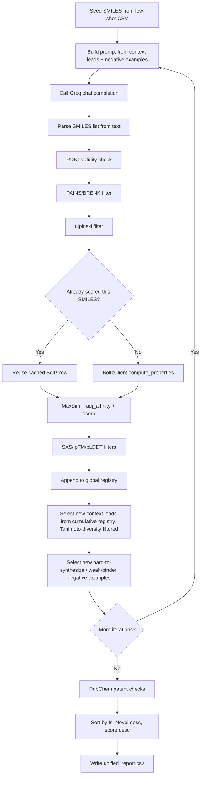

# Component: Generator (`src/generator.py`)

## Purpose
Implements the iterative molecule generation and ranking loop, including the
positive/negative feedback loop that steers later iterations.

## Core Class
- `MoleculeGenerator`
  - Dependencies:
    - Groq client via `get_cached_groq_client`
    - `BoltzClient` for model-based scoring
    - `PubChemService` for novelty/patent checks
    - RDKit PAINS/BRENK filter catalog (cached)

## Iteration Pipeline

## Feedback Loop Details
- **Caching**: `scored_rows_by_smiles` remembers every SMILES already scored by
  Boltz, so a repeated proposal across iterations is never resubmitted.
- **Positive leads**: after each iteration, candidate leads are ranked by score
  from the **cumulative `global_registry`** (all iterations so far, deduplicated
  keeping each SMILES's best score) -- not just the current iteration's batch --
  then filtered so a new lead's Tanimoto similarity to every lead already in the
  pool stays below `DEFAULT_LEAD_DIVERSITY_MAX_SIM` (`0.9`). This is what lets an
  early strong candidate keep steering later prompts.
- **Negative leads**: `_select_negative_leads` finds two failure modes each
  iteration -- strong binders that are too hard to synthesize
  (`Affinity_Prob > threshold` and `SAS > SAS_SCORE_MAX`) and easily synthesizable
  weak binders (`SAS <= SAS_SCORE_MAX` and `Affinity_Prob <= threshold`) -- and
  feeds new (not-yet-seen) examples of each back into the next prompt as explicit
  "avoid" clauses.

## Scoring Logic
- `adj_affinity = Affinity_Prob` when `Affinity_Prob > ADJ_AFFINITY_THRESHOLD` (default `0.6`), else `0`.
- `score = adj_affinity` with over-similarity penalty:
  - If `MaxSim > 0.9`, score is reduced by `0.5 * adj_affinity`.
  - Result is scaled by `synth_factor`, which is `1.0` at `SAS_SCORE_MIN` and `0.0` at `SAS_SCORE_MAX`.
- Final molecules must pass `SAS <= SAS_SCORE_MAX` (default `6.0`), `ipTM >= IPTM_THRESHOLD`
  (default `0.5`), and `pLDDT >= PLDDT_THRESHOLD` (default `0.5`).

## Pocket-Aware Mode
- If enabled, obtains pocket residues via `get_binding_pockets_and_residues`.
- Residue labels (for example `ALA10_C`) are parsed into `(chain_id, residue_index)` pairs,
  then filtered to `PipelineOptions.target_chain_id` -- the same chain the submitted protein
  sequence was extracted from -- before being remapped onto Boltz's single-polymer id `"A"`.
  Contacts detected on any other chain are dropped with a warning, since their residue
  numbering doesn't correspond to the sequence actually sent to Boltz.
- If disabled, prompt switches to analog generation without pocket constraints.

## Inputs
- `PipelineOptions` with PDB path, sequence, target chain id, few-shot CSV, iteration/sample limits.

## Output
- Returns report path (`str`) on success.
- Returns `None` if no molecules survive processing.
