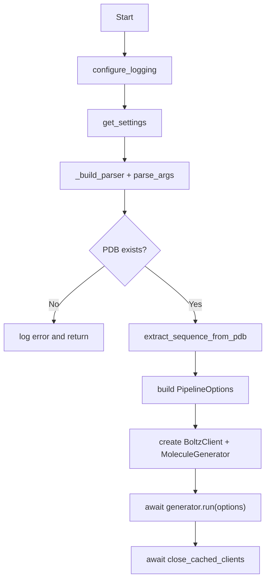

# Component: CLI (`main.py`)

## Purpose
Owns top-level orchestration: settings load, argument parsing, sequence extraction, generator wiring, and cleanup.

## Main Responsibilities
- Load `AppSettings` from `.env` and environment variables.
- Parse CLI flags (`--pdb`, `--csv`, `--out`, `--iters`, `--samples`, `--no-pocket`).
- Validate PDB path existence.
- Extract protein sequence with `extract_sequence_from_pdb`.
- Construct `PipelineOptions` and execute `MoleculeGenerator.run`.
- Always close cached async clients in `finally`.

## Flow

```mermaid
flowchart TD
    <!-- A[Start] --> B[configure_logging]
    B --> C[get_settings]
    C --> D[_build_parser + parse_args]
    D --> E{PDB exists?}
    E -->|No| F[log error and return]
    E -->|Yes| G[extract_sequence_from_pdb]
    G --> H[build PipelineOptions]
    H --> I[create BoltzClient + MoleculeGenerator]
    I --> J[await generator.run(options)]
    J --> K[await close_cached_clients] -->
```


## Inputs
- Settings from `src.core.config.AppSettings`.
- CLI args from the user.

## Outputs
- On success: `results/unified_report.csv` generated by generator.
- On failure paths: logs errors and exits cleanly.

## Notable Behavior
- Settings validation errors are logged with exact missing field names.
- `--no-pocket` flips `use_pocket_data` to `False` for non-interactive runs.
