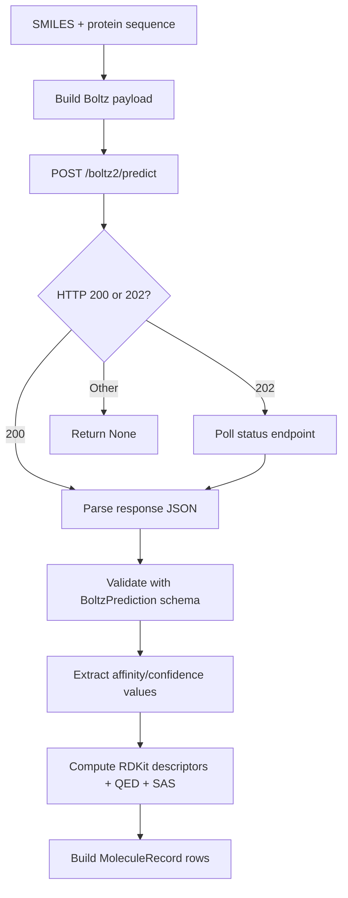

# Component: NVIDIA Client (`src/nvidia_client.py`)

## Purpose
Wraps NVIDIA Boltz API calls and computes molecule property rows for downstream ranking.

## Public API
- `BoltzClient.make_nvcf_call(smiles, sequence, pocket_residues=None)`
- `BoltzClient.compute_properties(smiles_list, sequence, pocket_residues=None)`

## Request/Response Flow

## External Endpoints
- Predict: `https://health.api.nvidia.com/v1/biology/mit/boltz2/predict`
- Polling: `https://api.nvcf.nvidia.com/v2/nvcf/pexec/status/{task_id}`

## Behavior Notes
- Polling checks every 5 seconds until completion/error.
- HTTP `429 Too Many Requests` responses are retried with a tenacity backoff policy.
- Missing `nvcf-reqid` on `202` is treated as failure (`None`).
- Schema validation failures are safely downgraded to `None`.
- `compute_properties` skips invalid SMILES and failed predictions.

## Output Columns Produced
- Boltz metrics: `pTM`, `ipTM`, `Confidence`, `pLDDT`, `Affinity_Prob`, `pIC50`, `IC50_uM`
- Chemistry descriptors: `MolWt`, `LogP`, `QED`, `SAS`, `TPSA`, `H_Acceptors`, `H_Donors`, `Rotatable_Bonds`

## Affinity Output Semantics
- `Affinity_Prob` (`affinity_probability_binary`) and `pIC50` (`affinity_pic50`) are two
  **independent** Boltz-2 model heads -- neither is derived from the other.
- `IC50_uM` *is* derived, but only from `pIC50`: `IC50[M] = 10^-pIC50`, converted to
  micromolar. It is not derived from `Affinity_Prob`.
- Filtering thresholds applied downstream in `MoleculeGenerator.run` (`src/generator.py`):
  `Affinity_Prob > ADJ_AFFINITY_THRESHOLD` (default `0.6`), `ipTM >= IPTM_THRESHOLD`
  (default `0.5`), `pLDDT >= PLDDT_THRESHOLD` (default `0.5`), `SAS <= SAS_SCORE_MAX`
  (default `6.0`).

## Chain Handling
- Boltz always submits the target as a single polymer with id `"A"`, regardless of the
  originating PDB chain letter. `_build_contacts` therefore maps every validated pocket
  contact to `"A"` unconditionally -- filtering contacts down to the actual target chain
  (which may be any letter, e.g. `"C"`) happens earlier, in `MoleculeGenerator.run`,
  using `PipelineOptions.target_chain_id`.
