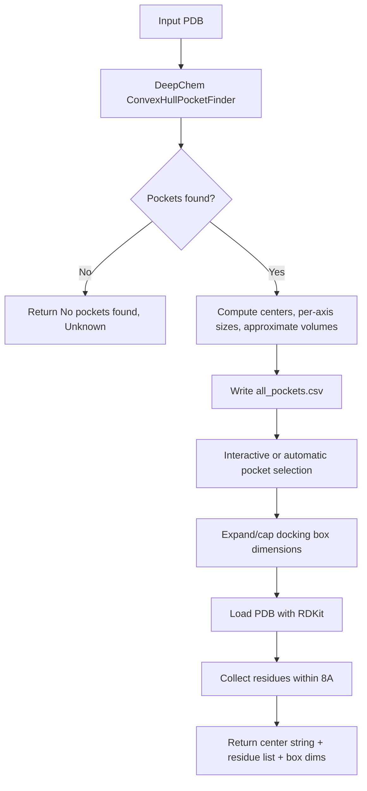

# Component: Pocket Utilities (`src/pocket.py`)

## Purpose
Detects target binding pockets and maps nearby residues used as optional generation constraints.

## Main Functions
- `get_binding_pockets_and_residues(pdb_path, output_dir="results")`
- `setup_p2rank()` and `get_p2rank_pocket(...)`

## Pocket Discovery Flow

## Selection Model
- Caller can pass a specific `pocket_index` to force a choice.
- Otherwise, pockets are filtered to those meeting `DEFAULT_POCKET_MIN_BOX_ANGSTROM`
  (`8.0`A) on every axis; the largest by volume among that qualifying set is chosen.
- If no pocket meets the minimum dimension, the largest pocket overall is used as a
  fallback (with a warning), rather than a lower-quality pocket being silently used.
- When run from an interactive TTY, the user is prompted with the largest-volume
  suggestion and can override it with any other detected pocket id.

## Docking Box Sizing
- Each axis of the selected pocket's box is expanded up to `DEFAULT_POCKET_MIN_BOX_ANGSTROM`
  (`8.0`A) and capped at `DEFAULT_POCKET_MAX_BOX_ANGSTROM` (`30.0`A).
- The returned box dims (`size_x/y/z`) reflect this adjusted box; the pre-adjustment
  values are also included as `raw_size_x/y/z` for transparency.

## Output Shape
- Pocket descriptor: `Center: x, y, z`
- Residue list: `ALA10_A, GLY27_B, ...` (chain letters reflect the source PDB and are
  not assumed to be `"A"` -- see `nvidia-client.md` for how these get remapped for Boltz)
- Box dims: `{center_x/y/z, size_x/y/z, raw_size_x/y/z}` (deepchem backend only)

## P2Rank Path
- `setup_p2rank` searches for `prank` executable under project directories and makes it executable.
- `get_p2rank_pocket` executes `prank predict` and parses top `residue_ids` from generated CSV.
