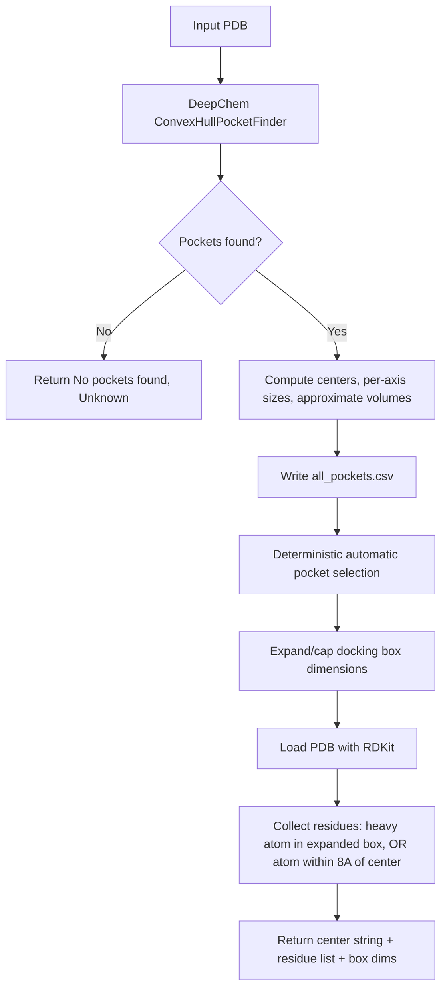

# Component: Pocket Utilities (`src/pocket.py`)

## Purpose
Detects target binding pockets and maps nearby residues used as optional generation constraints.

## Main Functions
- `get_binding_pockets_and_residues(pdb_path, output_dir="results")`
- `setup_p2rank()` and `get_p2rank_pocket(...)`

## Pocket Discovery Flow

## Selection Model
- Caller can pass an explicit `pocket_index` (any value in `[0, len(pockets))`) to force
  a choice. The default (`-1`) is deliberately out of range, so it always falls through
  to automatic selection instead of silently forcing pocket `0`.
- Otherwise, pockets are filtered to those meeting `DEFAULT_POCKET_MIN_BOX_ANGSTROM`
  (`8.0`A, raw hull dimensions, before any margin) on every axis; the **smallest** by
  volume among that qualifying set is chosen -- this minimizes the docking search space
  while still guaranteeing a ligand-sized cavity.
- If no pocket meets the minimum dimension, the largest pocket overall is used as a
  fallback (with a warning) -- a degenerate near-zero-volume artifact would be a worse
  default than an oversized one.
- Selection is always deterministic and non-interactive; there is no TTY prompt or
  manual-override path, so a given PDB always yields the same selected pocket.

## Docking Box Sizing
- Each axis of the *selected* pocket's box is isotropically expanded by
  `DEFAULT_POCKET_BOX_MARGIN_ANGSTROM` (`+5.0`A, additive, not a floor) to accommodate
  side-chain flexibility, then capped at `DEFAULT_POCKET_MAX_BOX_ANGSTROM` (`30.0`A).
  This margin is only applied post-selection -- it does not affect which pocket
  qualifies or gets chosen above.
- The returned box dims (`size_x/y/z`) reflect this adjusted box; the pre-adjustment
  values are also included as `raw_size_x/y/z` for transparency.

## Residue Selection Criteria
A residue is included if any of its atoms satisfies **either** of two complementary
criteria:
1. A heavy atom (`GetAtomicNum() != 1`) falls within the expanded docking box
   (the same box described above, i.e. `|offset| <= size/2` per axis).
2. Any atom (heavy or not) is within `DEFAULT_POCKET_CONTACT_DISTANCE` (`8.0`A)
   of the pocket center.

## Output Shape
- Pocket descriptor: `Center: x, y, z`
- Residue list: `ALA10_A, GLY27_B, ...` (chain letters reflect the source PDB and are
  not assumed to be `"A"` -- see `nvidia-client.md` for how these get remapped for Boltz)
- Box dims: `{center_x/y/z, size_x/y/z, raw_size_x/y/z}` (deepchem backend only)

## P2Rank Path
- `setup_p2rank` searches for `prank` executable under project directories and makes it executable.
- `get_p2rank_pocket` executes `prank predict` and parses top `residue_ids` from generated CSV.
