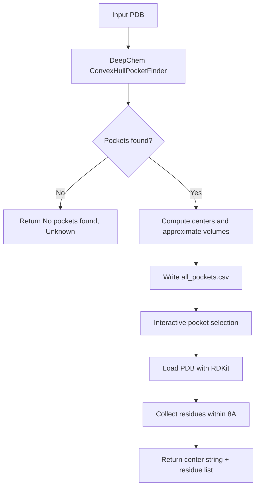

# Component: Pocket Utilities (`src/pocket.py`)

## Purpose
Detects target binding pockets and maps nearby residues used as optional generation constraints.

## Main Functions
- `get_binding_pockets_and_residues(pdb_path, output_dir="results")`
- `setup_p2rank()` and `get_p2rank_pocket(...)`

## Pocket Discovery Flow

## Selection Model
- Caller can pass a specific `pocket_index`.
- `0` selects largest approximate volume automatically.
- Selection is non-interactive.

## Output Shape
- Pocket descriptor: `Center: x, y, z`
- Residue list: `ALA10_A, GLY27_B, ...`

## P2Rank Path
- `setup_p2rank` searches for `prank` executable under project directories and makes it executable.
- `get_p2rank_pocket` executes `prank predict` and parses top `residue_ids` from generated CSV.
