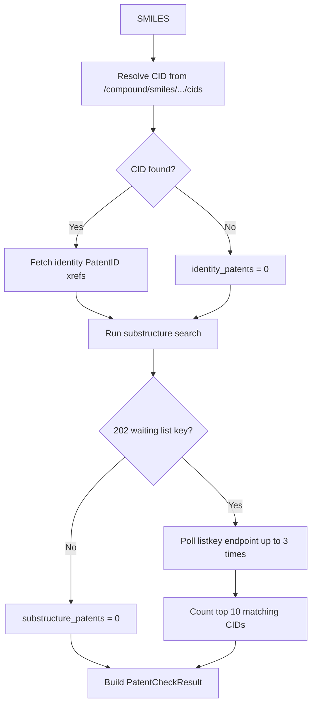

# Component: PubChem Service (`src/services/pubchem.py`)

## Purpose
Adds novelty and patent-related indicators to final candidate molecules.

## Public API
- `PubChemService.check_patents(smiles)`
- `check_pubchem_patents(smiles)` (legacy tuple wrapper)

## Request Flow

## Interpretation
- `pubchem_cid` present implies known compound identity.
- `identity_patents` approximates direct identity patent signal.
- `substructure_patents` approximates broad prior-art density.

## Error Handling
- HTTP and parsing failures are caught and mapped to empty defaults (`PatentCheckResult()`).
