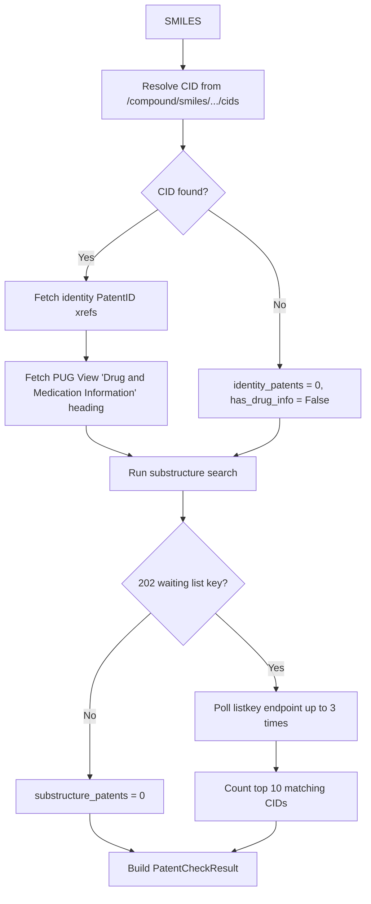

# Component: PubChem Service (`src/services/pubchem.py`)

## Purpose
Adds novelty and patent-related indicators to final candidate molecules.

## Public API
- `PubChemService.check_patents(smiles)`

## Request Flow

## Interpretation
- `pubchem_cid` present implies known compound identity.
- `identity_patents` approximates direct identity patent signal.
- `substructure_patents` approximates broad prior-art density.
- `has_drug_info` is `True` when PubChem's PUG View has a populated "Drug and
  Medication Information" section for the CID (HTTP 200 on the heading-filtered
  lookup) -- indicates documented pharmacological/clinical use, not just registry
  presence. `False` on PUG View's `PUGVIEW.NotFound` (HTTP 404) response.
- These four signals combine into `PubChem_Classification` in the final report:
  `"Novel/Not in PubChem"` (no CID) -> `"Known Drug/Medication"` (`has_drug_info`)
  -> `"Patent-Referenced"` (CID + any patent hits, no drug info) -> `"Known
  Compound (Unclassified)"` (CID with neither). This reflects PubChem's own
  annotation coverage, not a legal drug-registry or freedom-to-operate check.

## Error Handling
- HTTP and parsing failures are caught and mapped to empty defaults (`PatentCheckResult()`).
